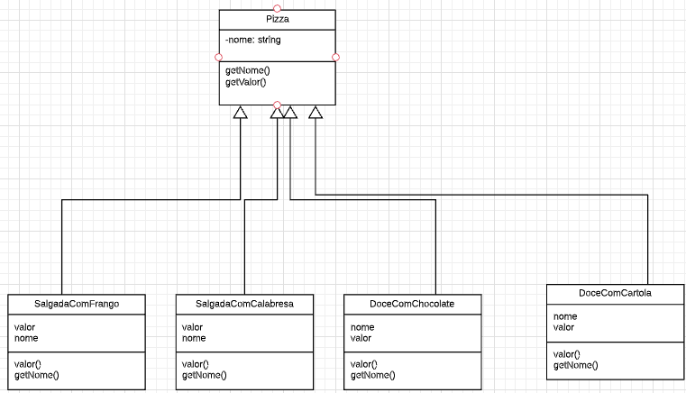
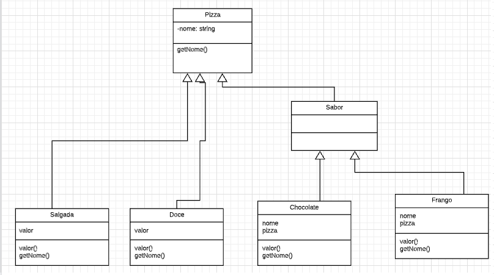

# Decorator
> O Decorator é uma alternativa para a criação de subclasses para estender funcionalidades, ele é um padrão de projeto que tem como objetivo anexar responsabilidades adicionais a um objeto dinamicamente,em tempo de execução, permitindo assim a expansão do objeto de maneira mais flexível.

## Características
- Os decoradores têm o mesmo supertipo que os objetos que eles decoram;
- Você pode usar um ou mais decoradores para englobar um objeto;
- Uma vez que o decorador tem o mesmo supertipo que o objeto decorado, podemos passar um objeto decorado no lugar do objeto original (englobado);
- O decorador adiciona seu próprio comportamento antes e/ou depois de delegar o objeto que ele decora o resto do trabalho;
- Os objetos podem ser decorados a qualquer momento, então podemos decorar os objetos de maneira dinâmica no tempo de execução com quantos decoradores desejarmos.

## Vantagens

- Aprimora a extensibilidade do objeto,pois as alterações são feitas codificando novas classes.
- Simplifica o desenvolvimento permitindo uma serie de classes com funcionalidades específicas,ao invés de codificar todo o comportamento no objeto.

## Desvantagens
- Quanto mais decorators em camadas, mais complexo seu código se torna.
- É difícil remover um invólucro específico da pilha de invólucros.
- É difícil implementar um decorador de forma que seu comportamento não dependa da ordem na pilha de decoradores.

## Problema

Imaginando que iremos fazer um sistema para uma pizzaria que vende pizzas salgada e doce e nos deparamos com um problema na qual o cliente pode escolher tipo  da pizza e os sabores,ou seja,nós teremos uma classe pai que se chama Pizza e as subclasses que seriam por exemplo SalgadoComFrango e DoceComChocolate logo nós temos um problema pois teremos que fazer uma subclasse para cada tipo de pizza que o cliente desejar. 
 
 

## Solução

Para solucionarmos o problema acima nos utilizaremos a estrategia do Decorator.Na qual iremos manter a classe pai Pizza e criaremos subclasses Salgada,Doce e Sabor que herdará de pizza e essa subclasse,Sabor, terá classes filhas com o nome  dos sabores como mostra a figura a seguir.

 
