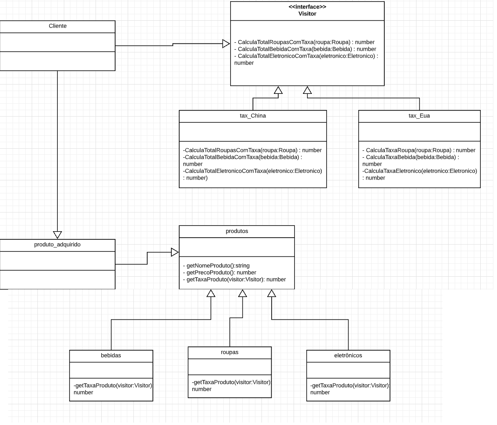

# Visitor
> O visitor é um padrão de projeto que representa uma operação a ser executada nos elementos de uma estrutura de objeto, permitindo-lhe definir uma nova operação sem alterar as classes dos elementos sobre os quais opera. 

## Características
-  Ele descreve uma maneira de adicionar novas operações às estruturas de objetos existentes sem modificar as próprias estruturas;
-  É uma maneira de implementar o princípio open/closed (OCP), que é um princípio de desenvolvimento de software orientado a objetos que afirma que cada entidade de software como módulos, classes ou funções, deve ser simultaneamente aberta para extensão, mas fechada para modificação.
- Um padrão de design de visitor permite que um “objeto visitante” seja definido separadamente , com o objetivo de implementar uma operação a ser realizada em um ou vários elementos da estrutura do objeto.

## Vantagens

-  Princípio open/closed. É possível introduzir um novo comportamento que possa trabalhar com objetos de diferentes classes sem alterar essas classes.
-  Princípio de responsabilidade única. É possível pode mover várias versões do mesmo comportamento para a mesma classe.
-  Limpa o código da regra de negócio
-  Separa algoritmos complexos em objetos auxiliares

## Desvantagens

-  Objetos visitantes podem não ter acesso a todos os membros dos objetos em que operam.
-  Se um novo objeto for adicionado à estrutura, será necessário atualizar os objetos visitantes.

## Problema

Imaginando que iremos fazer um sistema para a receita federal onde nos foi solicitado a criação de um software para gerenciar a taxação(também conhecida como alíquota) das importações de produtos internacionais para compras realizadas na internet, com o destinatário localizado no Brasil. No caso, foi pedido para que o software gerencie produtos de 3 tipos diferentes: roupas, eletrônicos e bebidas alcólicas, e faça a taxação de acordo com o país que exportou esse produto, no caso foram selecionado os países que mais exportam para o Braisil, os Estados Unidos e a China. O objetivo desse software é para que a pessoa que faça a compra final já tenha o valor total dos produtos somado com o valor da taxação em que cada um desses produtos sofre ao passar pela alfândega.
 

## Solução

Para solucionarmos o problema acima nós utilizaremos a estratégia do Visitor, onde criaremos classes diferentes para esses três tipos de produtos, uma classe abstrata "produtos" para ser extendida por essas três classes e duas classes para identificar os países Estados Unidos e China. Para selecionar a taxação que cada um desses produtos vai sofrer ao chegar do seu país natal ao Brasil, ao invés de passar em classe por classe adicionando essa taxação, utilizarei justamente o “objeto visitante” que vai visitar cada uma das minhas estruturas de produto, bem como sendo extendida pela minha estrutura de países, adicionando a taxa cobrada por cada um deles.

 
